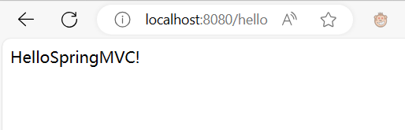
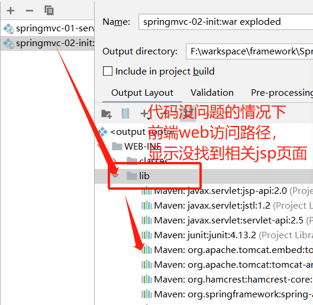

# Spring MVC

## 1.什么是SpringMVC

**1.概述**

SpringMVC是Spring Framework的一部分，是基于Java是西安的MVC轻量级Web框架

官网文档：https://docs.spring.io/spring/docs/5.2.0.RELEASE/spring-framework-reference/web.html#spring-web

- 优点：

    - 轻量级，简单易学
    - 高效，基于请求响应的MVC框架
    - 与Spring兼容性好，无缝结合
    - 约定大于配置
    - 功能强大： RESTFul、数据验证、格式化、本地化、主体等。
    - 简洁灵活

**用的人多**

## 2.HelloSpring 入门（配置版）

**web.xml**

```xml
<?xml version="1.0" encoding="UTF-8"?>
<web-app xmlns="http://xmlns.jcp.org/xml/ns/javaee"
         xmlns:xsi="http://www.w3.org/2001/XMLSchema-instance"
         xsi:schemaLocation="http://xmlns.jcp.org/xml/ns/javaee http://xmlns.jcp.org/xml/ns/javaee/web-app_4_0.xsd"
         version="4.0">
    <!--1.注册DispatcherServlet-->
    <servlet>
        <servlet-name>springmvc</servlet-name>
        <servlet-class>org.springframework.web.servlet.DispatcherServlet</servlet-class>
        <!--关联一个springmvc的配置文件:【servlet-name】-servlet.xml-->
        <init-param>
            <param-name>contextConfigLocation</param-name>
            <param-value>classpath:springmvc-servlet.xml</param-value>
        </init-param>
        <!--启动级别-1-->
        <load-on-startup>1</load-on-startup>
    </servlet>
    <!--/ 匹配所有的请求；（不包括.jsp）-->
    <!--/* 匹配所有的请求；（包括.jsp）-->
    <servlet-mapping>
        <servlet-name>springmvc</servlet-name>
        <url-pattern>/</url-pattern>
    </servlet-mapping>
</web-app>

```

**springmvc-servlet.xml**

```xml
<?xml version="1.0" encoding="UTF-8"?>
<beans xmlns="http://www.springframework.org/schema/beans"
       xmlns:xsi="http://www.w3.org/2001/XMLSchema-instance"
       xsi:schemaLocation="http://www.springframework.org/schema/beans http://www.springframework.org/schema/beans/spring-beans.xsd">

    <!--添加映射器-->
    <bean class="org.springframework.web.servlet.handler.BeanNameUrlHandlerMapping"/>
    <!--添加适配器-->
    <bean class="org.springframework.web.servlet.mvc.SimpleControllerHandlerAdapter"/>

    <!--添加视图解析器-->
    <bean class="org.springframework.web.servlet.view.InternalResourceViewResolver">
        <property name="prefix" value="/WEB-INF/jsp/"/>
        <property name="suffix" value=".jsp"/>
    </bean>

    <!--Handler-->
    <bean id="/hello" class="com.shiasan.controller.HelloController"/>

</beans>
```

**HelloController**

```java
package com.shiasan.controller;

import org.springframework.web.servlet.ModelAndView;
import org.springframework.web.servlet.mvc.Controller;

import javax.servlet.http.HttpServletRequest;
import javax.servlet.http.HttpServletResponse;

//注意：这里我们先导入Controller接口
public class HelloController implements Controller {
    public ModelAndView handleRequest(HttpServletRequest request, HttpServletResponse response) throws Exception {
        //ModelAndView 模型和视图
        ModelAndView mv = new ModelAndView();
        //封装对象，放在ModelAndView中。Model
        mv.addObject("msg", "HelloSpringMVC!");
        //封装要跳转的视图，放在ModelAndView中
        mv.setViewName("hello"); //: /WEB-INF/jsp/hello.jsp
        return mv;
    }

}

```

**运行Tomcat**


**遇到的问题**



在WEB-INF下添加一个lib的文件夹，将需要用的jar包全部放进去

## 3.使用注解入门SpringMCV

**web.xml**

```xml
<?xml version="1.0" encoding="UTF-8"?>
<web-app xmlns="http://xmlns.jcp.org/xml/ns/javaee"
         xmlns:xsi="http://www.w3.org/2001/XMLSchema-instance"
         xsi:schemaLocation="http://xmlns.jcp.org/xml/ns/javaee http://xmlns.jcp.org/xml/ns/javaee/web-app_4_0.xsd"
         version="4.0">

    <!--1.注册DispatcherServlet-->
    <servlet>
        <servlet-name>springmvc</servlet-name>
        <servlet-class>org.springframework.web.servlet.DispatcherServlet</servlet-class>
        <!--关联一个springmvc的配置文件:【servlet-name】-servlet.xml-->
        <init-param>
            <param-name>contextConfigLocation</param-name>
            <param-value>classpath:springmvc-servlet.xml</param-value>
        </init-param>
        <!--启动级别-1-->
        <load-on-startup>1</load-on-startup>
    </servlet>
    <!--/ 匹配所有的请求；（不包括.jsp）-->
    <!--/* 匹配所有的请求；（包括.jsp）-->
    <servlet-mapping>
        <servlet-name>springmvc</servlet-name>
        <url-pattern>/</url-pattern>
    </servlet-mapping>
</web-app>

```

**springmvc-config.xml**

```xml
<?xml version="1.0" encoding="UTF-8"?>
<beans xmlns="http://www.springframework.org/schema/beans"
       xmlns:xsi="http://www.w3.org/2001/XMLSchema-instance"
       xmlns:context="http://www.springframework.org/schema/context"
       xmlns:mvc="http://www.springframework.org/schema/mvc"
       xsi:schemaLocation="http://www.springframework.org/schema/beans http://www.springframework.org/schema/beans/spring-beans.xsd http://www.springframework.org/schema/context https://www.springframework.org/schema/context/spring-context.xsd http://www.springframework.org/schema/mvc https://www.springframework.org/schema/mvc/spring-mvc.xsd">

    <!--自动扫面包，指定包下的注解生效，有IOC统一管理-->
    <context:component-scan base-package="com.shisan.controller"/>

    <!--
    让springmvc不处理静态资源
        <bean id="/hello" class="com.shiasan.controller.HelloController"/>
    -->
    <mvc:default-servlet-handler/>
    <!--
        支持mvc注解驱动
        在spring种一百采用@RequsetMapping注解来完成映射关系
        必须向上下文中注册DefaultAnnotationHandlerMapping
        这个两个实例分别在类级别和方法级别处理
        而annotation-driven配置帮助我们完成两个实力的注入
        相当于
        添加映射器
    <bean class="org.springframework.web.servlet.handler.BeanNameUrlHandlerMapping"/>
        添加适配器
    <bean class="org.springframework.web.servlet.mvc.SimpleControllerHandlerAdapter"/>

    -->
    <mvc:annotation-driven/>

    <bean class="org.springframework.web.servlet.view.InternalResourceViewResolver">
        <property name="prefix" value="/WEB-INF/jsp/"/>
        <property name="suffix" value=".jsp"/>
    </bean>
</beans>
```

**Controller**

```java
package com.shisan.controller;

import org.springframework.stereotype.Controller;
import org.springframework.ui.Model;
import org.springframework.web.bind.annotation.RequestMapping;

/**
 * @Author:shisan
 * @Date:2023/11/1 15:24
 */
@Controller
public class HelloController {
    @RequestMapping("/hello")
    public String hello(Model model) {
        model.addAttribute("msg", "Hello SpringMVC!");
        return "hello";
    }
}
```

**总结**

实现步骤其实非常的简单：

- 新建一个web项目
- 导入相关jar包
- 编写web.xml , 注册DispatcherServlet
- 编写springmvc配置文件
- 接下来就是去创建对应的控制类 , controller
- 最后完善前端视图和controller之间的对应
- 测试运行调试.

使用springMVC必须配置的三大件：

- 处理器映射器、处理器适配器、视图解析器

通常，我们只需要手动配置视图解析器，而处理器映射器和处理器适配器只需要开启注解驱动即可，而省去了大段的xml配置